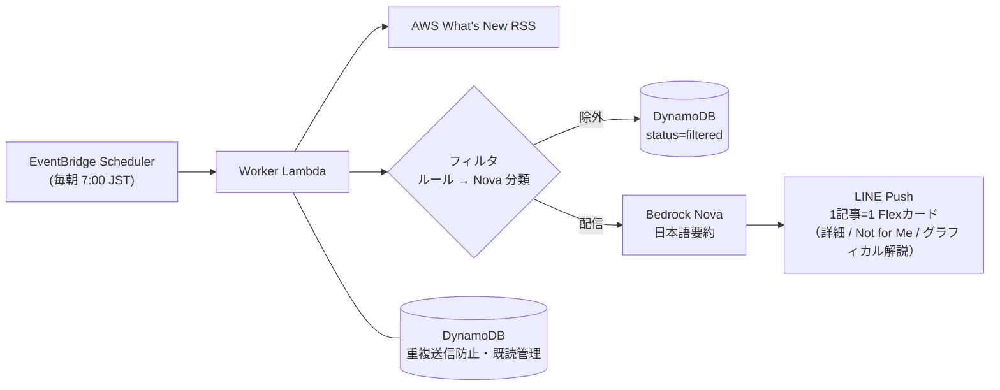
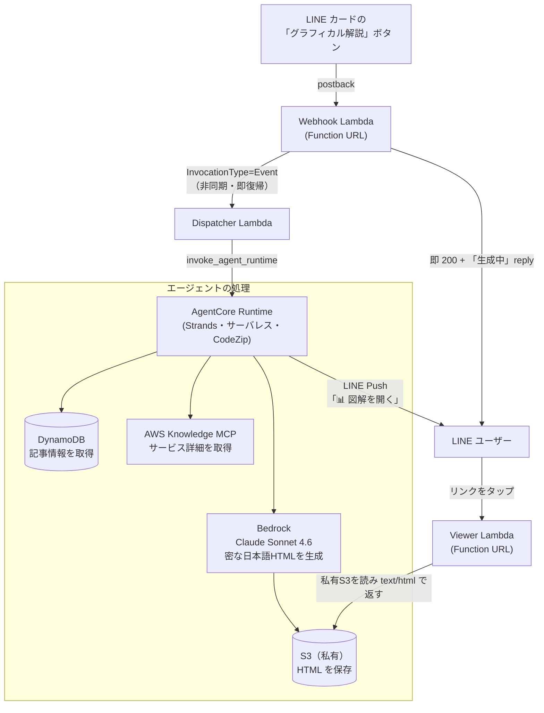

# aws-whatsnew-agent

AWS の新機能情報（What's New）を毎朝要約して LINE に届け、さらに各記事を **AI エージェントがその場でグラフィカルな図解に変換**するサービス。

- **Phase 1 / 1.5（決定論パイプライン・稼働中）**: What's New RSS → ルール＋LLM でフィルタ → Amazon Bedrock (Nova) で日本語要約 → LINE に 1 記事 = 1 Flex カードで配信。各カードに「Not for Me」フィードバックボタン。
- **Phase 2（エージェント・稼働中）**: カードの「グラフィカル解説」ボタンを押すと、**Amazon Bedrock AgentCore Runtime**（サーバレス）上のエージェントが、記事情報に **AWS Knowledge MCP** で取得したサービス詳細を加え、**Claude で密な日本語インフォグラフィック HTML** を生成。私有 S3 に置き、閲覧用 Lambda の短い URL を LINE に Push する（スマホ対応のレスポンシブ HTML）。

すべて IAM で完結し、長期キーは持たない。詳細は [`docs/plan.md`](docs/plan.md) / [`docs/spec.md`](docs/spec.md) / [`docs/agentcore-plan.md`](docs/agentcore-plan.md)。

## フロー図解

### Phase 1 / 1.5 — 毎朝の要約配信（決定論パイプライン）

### Phase 2 — 「グラフィカル解説」ボタン → 図解エージェント（オンデマンド）

**要点**
- 図解生成は数分かかるため **webhook → dispatcher(Event 非同期) → AgentCore** の2段で webhook を即応させる。
- presigned URL は LINE の URI ボタン上限(1000字)を超えるため、**バケットは私有のまま Viewer Lambda が短い URL で配信**する。
- 生成物は **スマホ対応のレスポンシブ HTML**（カードは列数自動、横長の図は横スクロール）。

## 構成 / デプロイ（2 スタック）

| 対象 | 実体 | デプロイ |
| --- | --- | --- |
| Worker / Webhook / Dispatcher / Viewer / S3 / DynamoDB / Scheduler / アラート | AWS CDK (Python) `stacks/` | `cdk deploy`（`AwsWhatsNewAgentStack`） |
| 図解エージェント本体 | AgentCore プロジェクト `whatsnewExpl/`（Strands・CodeZip） | `agentcore deploy`（`@aws/agentcore` CLI） |

- LINE トークン等のシークレットは Git 管理外（SSM SecureString / `~/.secrets/`）。リポジトリには `.env.example` のみ。
- `whatsnewExpl/agentcore/aws-targets.json`（デプロイ先アカウント）は各自ローカルに作成する（`aws-targets.example.json` 参照）。

## 技術スタック
Python 3.12 / AWS（us-east-1）/ Amazon Bedrock（Nova・Claude Sonnet 4.6）/ Amazon Bedrock AgentCore / AWS Knowledge MCP / AWS CDK / LINE Messaging API
